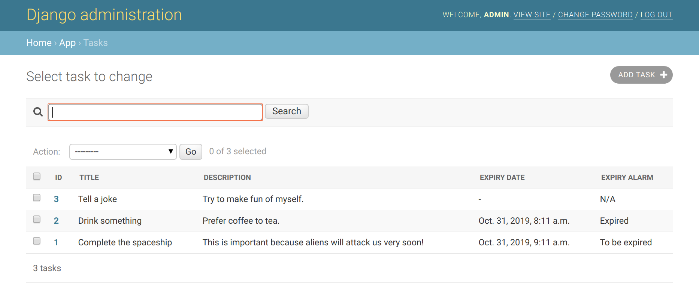
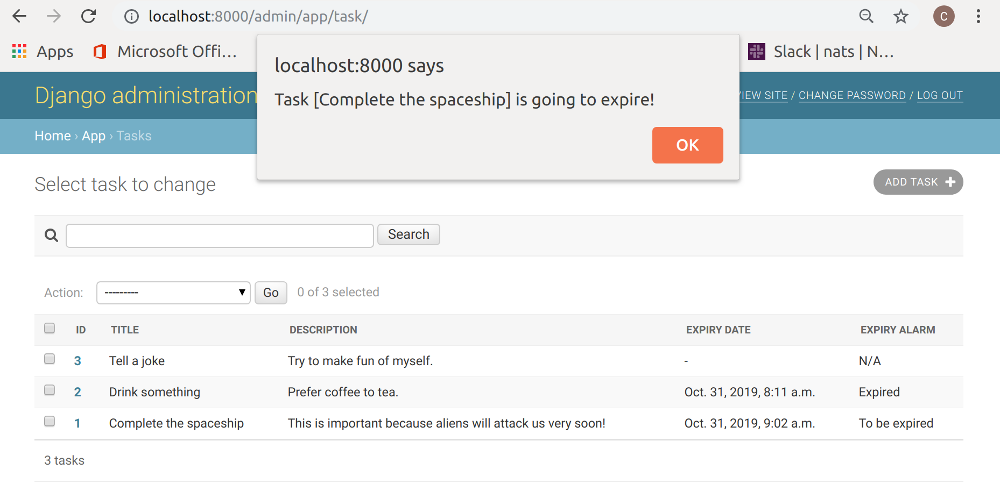

# Task management server with RESTful API

This is a simple Linux server program for creating, updating, removing and fetching tasks. The web API follows the rules of a RESTful API.
Here are the external libraries used:

* Django: the web framework
* Django REST Framework: the RESTful API framework
* SQLite: the database

## Project setup

```bash
# After downloading this project, go to the directory
cd task_django

# Create virtual environment
python3 -m venv env
source env/bin/activate

# Install external libraries
pip install django djangorestframework

# Sync database
cd project
python manage.py makemigrations
python manage.py migrate --run-syncdb

# Create initial user (with admin rights)
python manage.py createsuperuser

# Create sample tasks for demonstration
python manage.py createsampletasks

# Run server
python manage.py runserver 0.0.0.0:8000
```

## Manage tasks with Django web API

Open any browser and go to ```localhost:8000```. You will see a login page.


Login as the initial user set in the previous section. Then you will see the admin page. Go to ```Tasks```.



On this page you can view, create, change or remove any task.

### Task expiry alarm

Keep this page alive, then you will receive alert popup whenever a task is going to expire (15 minutes before expiry).



## Manage tasks with RESTful API

Open any browser and go to ```localhost:8000/rest/tasks/```. You will see the list of tasks represented in JSON.
You may need to login as the initial user set in the previous section, by clicking the link at the upper right corner.
Go to ```localhost:8000/rest/tasks/1/``` and you will see the specific task (ID = 1) represented in JSON.
You may also use other tools (e.g. Postman, Curl) to access those URLs and the content will be raw JSON.
